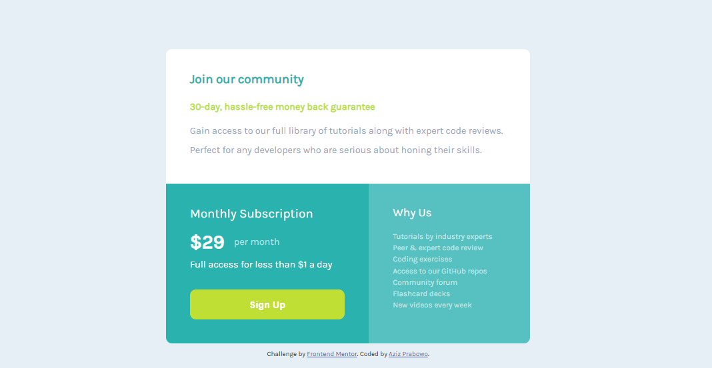

# Frontend Mentor - Single price grid component solution

This is a solution to the [Single price grid component challenge on Frontend Mentor](https://www.frontendmentor.io/challenges/single-price-grid-component-5ce41129d0ff452fec5abbbc). Frontend Mentor challenges help you improve your coding skills by building realistic projects.

## Table of contents

- [Overview](#overview)
  - [The challenge](#the-challenge)
  - [Screenshot](#screenshot)
  - [Links](#links)
- [My process](#my-process)
  - [Built with](#built-with)
  - [What I learned](#what-i-learned)
- [Author](#author)

## Overview

### The challenge

Users should be able to:

- View the optimal layout for the component depending on their device's screen size
- See a hover state on desktop for the Sign Up call-to-action


### Screenshot



### Links

- Solution URL: [SOLUTION](https://www.frontendmentor.io/solutions/responsive-single-price-grid-using-css-grid-Wj-qr6DJ6-)
- Live Site URL: [LIVE SITE](https://azizp128.github.io/single-price-grid-component/)

## My process

### Built with

- Semantic HTML5 markup
- CSS custom properties
- Flexbox
- CSS Grid
- Mobile-first workflow

### What I learned

I learned how to align content & items to the center of the page using flexbox.

To see how you can add code snippets, see below:

```css
.container {
  display: flex;
  flex-direction: column;
  place-content: center;
  height: 100vh;
}

main {
  display: flex;
  flex-direction: column;
  place-items: center;
}
```

## Author

- Frontend Mentor - [@azizp128](https://www.frontendmentor.io/profile/azip128)
- Twitter - [@azizprbw](https://www.twitter.com/azizprbw)
